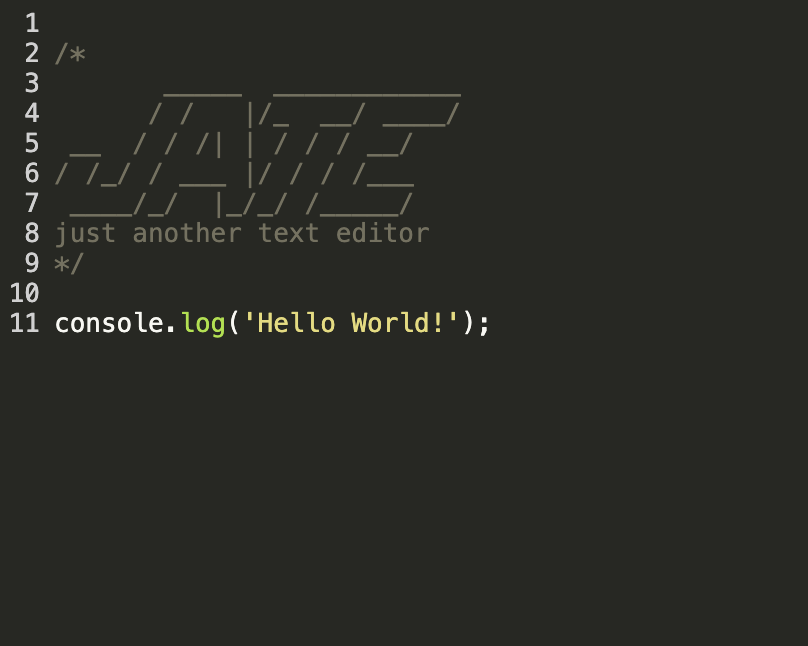
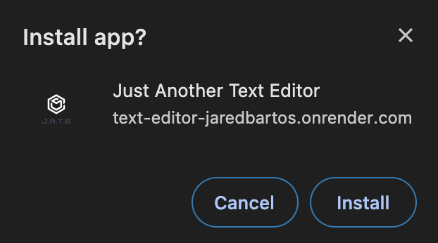
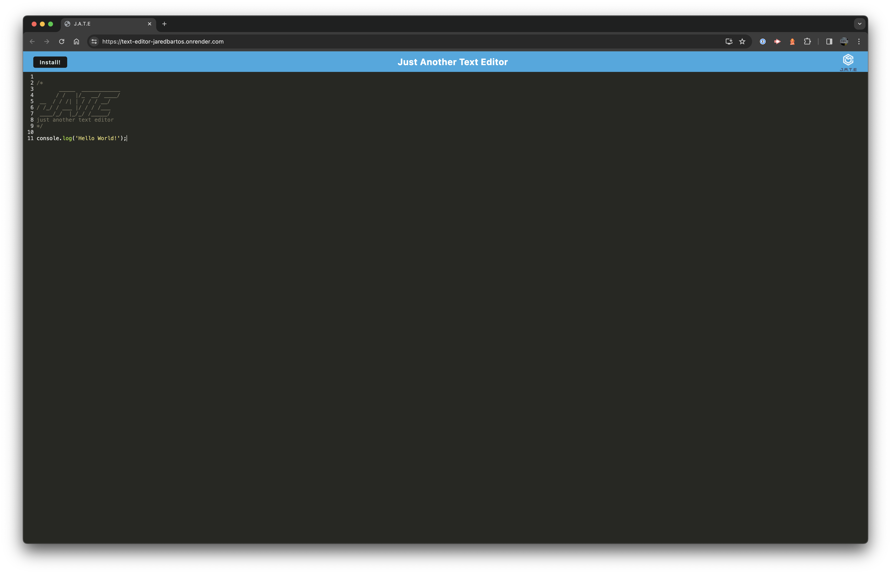
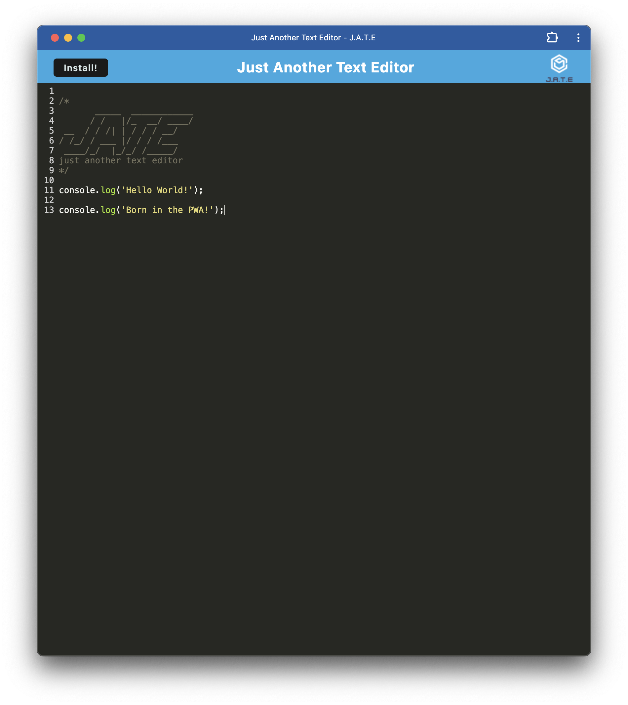

# J.A.T.E. - Just Another Text Editor

## Deployed App

[J.A.T.E.](https://text-editor-jaredbartos.onrender.com/)

## Description

J.A.T.E. might be just another text editor; however, by utilizing the power of Progressive Web Apps, J.A.T.E. goes from a one-trick pony to a worthwhile and flexible hybrid. J.A.T.E. was built using Webpack, Workbox and Express. As a PWA, it can be downloaded onto a device through a web browser and function like a platform-specific app, as well as work offline. While online, changes made in downloaded app will be shown in deployed URL after refresh and vice versa. J.A.T.E. also features JavaScript syntax highlighting. Visit the link above to get started!

## Table of Contents
- [Requirements](#requirements)
- [Installation](#installation)
- [Usage](#usage)
- [License](#license)
- [Questions](#questions)
- [Screenshots](#screenshots)

## Requirements

Most web browsers will work with PWAs. If using one other than [Google Chrome](https://www.google.com/chrome/), please check your browser's documentation for support.

## Installation

To install onto your device, visit [J.A.T.E.](https://text-editor-jaredbartos.onrender.com/) and click the `Install!` button. The following box will appear under your location bar in your browser:

Your downloaded app will then open on your device and will be accessible from wherever your apps are stored.

## Usage

## License

This application is covered under MIT License.

Please refer to the LICENSE file in repo for more information.

## Questions

My GitHub profile: https://github.com/jaredbartos

If you have any further questions, please contact me through email.

jaredbartos@gmail.com

## Screenshots

